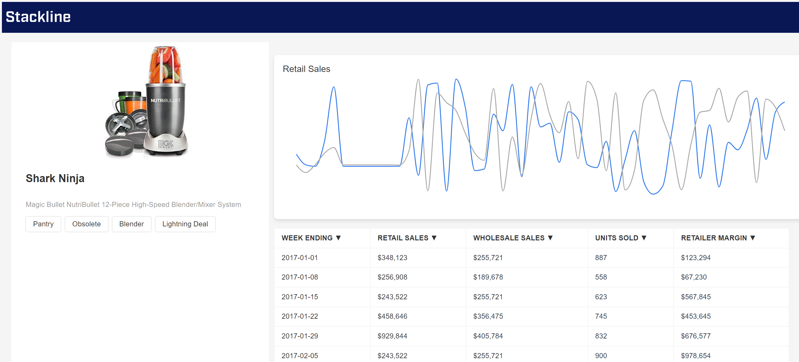

# Stackline Frontend Assessment



GitHub Repo: https://github.com/danieljbae/stackline.git \
Deployment Link: https://danieljbae.github.io/stackline

## Assesment Requirements:
- [x] Redux to manage application state globally
- [x] Product Details
- [x] Sales Graph
- [x] Sales Table
- [x] Table sorting by column


## TODO Features:
- [ ] Dynamically update `SalesChart` based on `SalesTable` sorting


## Installation

1. Clone the repository
```sh
git clone https://github.com/danieljbae/stackline.git
```

1. Install NPM packages
```sh
npm i
```

1. Start the project
```sh
npm start
```

## Deployment 
To build and deploy this project on GitHub Pages, run:
```sh
npm run build
npm run deploy
```
